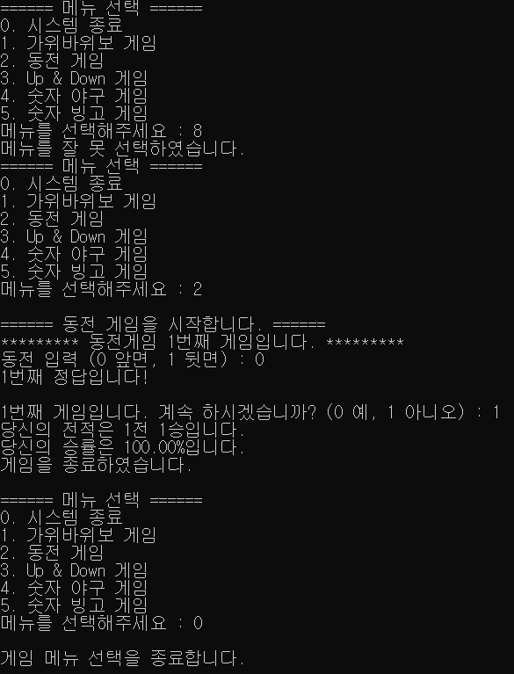
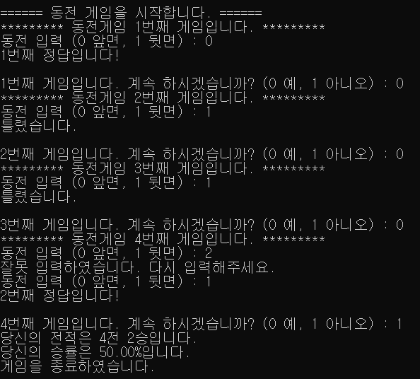
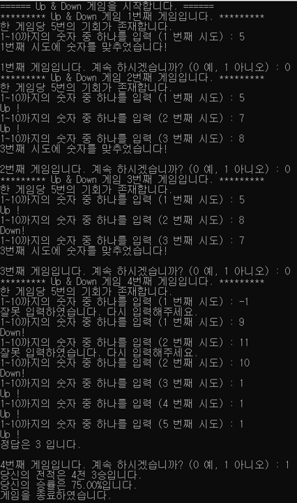
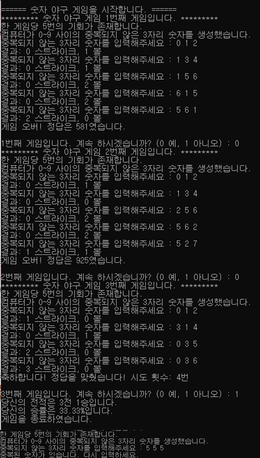
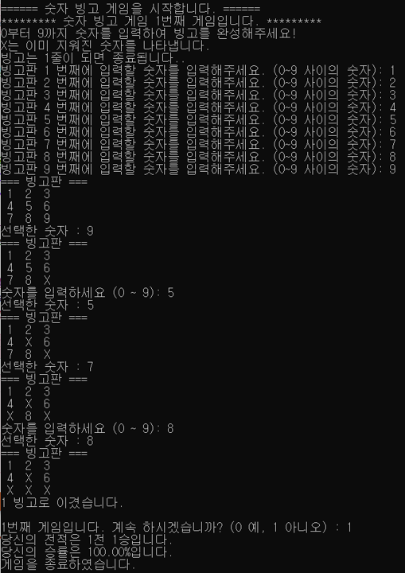

# C-Programming Mini-Game Collection
**1학년 2학기 C프로그래밍 기말 과제**    
C언어를 활용하여 구현한 5종 미니 게임 세트입니다.    
메인 메뉴를 통해 원하는 게임을 선택하고 플레이할 수 있으며,    
각 게임은 모듈화된 헤더 파일로 관리됩니다.


## 게임
* **가위바위보/동전게임** : srand() 함수를 활용한 게임
* **Up&Down** : 힌트를 제공하는 숫자 맞추기 게임
* **숫자 야구** : 중복없는 난수 생성 알고리즘과 볼/스트라이크 판정 로직 구현
* **숫자 빙고** : 2차원 배열 5x5를 활용하여 실시간 빙고 줄 체크

## Project Structure 
```
C-Programming/
├── images/
│   ├── img_select_menu.png
│   ├── img_game_bingo.png
│   ├── img_game_coin.png
│   └── ...
├── main.c                     # 프로그램 시작 및 메뉴 실행
├── select_menu.h              # 메뉴 선택 및 라우팅 함수
├── game_rock_paper_scissors.h # 가위바위보
├── game_coin.h                # 동전 게임
├── game_up_and_down.h         # Up & Down
├── game_num_ball.h            # 숫자 야구
└── game_bingo.h               # 숫자 빙고
```

## Prgoram Screenshots
| 메뉴 | 이미지 |
| :---: | :---: |
| 메뉴 선택 |  |
| 가위바위보 게임 |  |
| 동전 게임 |  |
| Up & Down 게임 |  |
| 숫자 야구 게임 |  |
| 숫자 빙고 게임 |  |